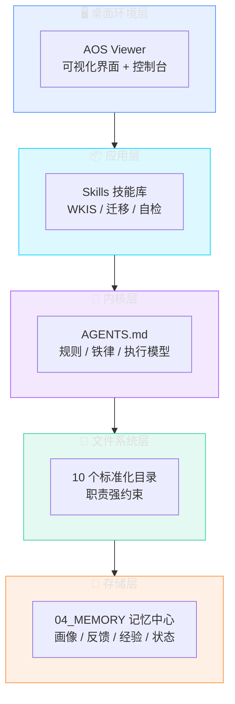
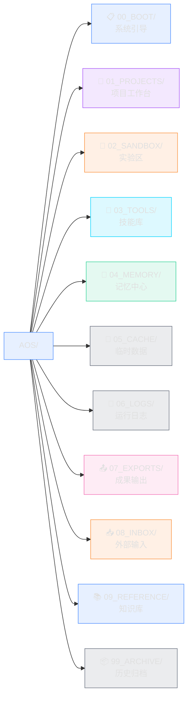
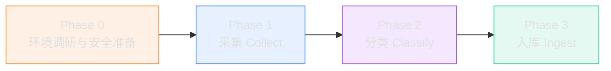

<div align="center">

# AOS — Agent Operating System

**AI 助手的操作系统：内核 · 文件系统 · 桌面 · 记忆大脑**

[🌐 官网](https://magicalyuyu.github.io/agent-operating-system/) · [📖 配置指南](docs/trae-setup-guide.md) · [🚀 快速开始](#快速开始)


</div>

---

## AOS 是什么

如果你用过 AI 编程工具，可能遇到过这些：

- 🔄 每次新对话都要重新介绍项目背景，AI 的"记忆"仅限当前窗口
- 🔀 同时推进多个项目，AI 经常把 A 项目的配置写到 B 里
- 🕳️ 上次犯过的错误，下次对话还会再犯
- 📦 好不容易摸索出的经验，对话一关就消失了
- 👁️ 系统状态全靠脑补，看不到、摸不着，更没法直观操作

**AOS 把 AI 助手当成一台计算机来管理。**

它为 AI 提供一整套操作系统形态的运行框架：有内核规则、有文件系统、有桌面界面、有应用商店、有持久记忆。AI 在这个系统里运行，就像程序在操作系统里运行——有规可循、有迹可查、有态可存。

> 传统 AI 工具是"单次对话"，AOS 是"持续运行的系统"。

---

## 系统架构：五层 OS 形态

AOS v1.1.0 是一个完整的 AI Agent 操作系统，由五层构成，每一层都对应着真实操作系统的概念：



| OS 概念 | AOS 对应 | 说明 |
|:--------|:---------|:-----|
| 🧠 **内核** | [AGENTS.md](AGENTS.md) | 规则体系、8 条铁律、执行模型、触发机制——AI 行为的根本法则 |
| 📁 **文件系统** | 10 个标准化目录 | 每个目录职责强约束，文件不会乱放，AI 不会把日志写到项目里 |
| 🖥️ **桌面环境** | [AOS Viewer](03_TOOLS/aos_viewer/) | 可视化界面——你的 AI 系统的"桌面"，一眼看清全貌，一键触发操作 |
| 📦 **应用程序** | [Skills 技能库](03_TOOLS/skills/) | 可复用工作流：知识入库、存量迁移、一致性自检——像安装 App 一样扩展能力 |
| 💾 **存储/记忆** | [04_MEMORY/](04_MEMORY/) | 跨会话持久化：用户画像、反馈经验、项目状态——关了对话也不会消失 |

---

## AOS Viewer：你的 AI 系统桌面

v1.1.0 的核心革新不是"加了可视化功能"，而是**让 AOS 从"一组文件"进化为"一套可见、可控、可操作的操作系统"**。

AOS Viewer 是这套操作系统的桌面环境——就像 macOS 之于 Darwin 内核、Windows 桌面之于 Windows NT。它不修改任何系统文件，但让你能够**看见**系统的每一个角落，**控制**每一个脚本。

### 三大核心价值

| 价值 | 传统方式 | AOS Viewer |
|:-----|:---------|:------------|
| 👁️ **可见性** | 文件散落各处，全靠 `find` 和记忆 | 系统总览 / Skill / 项目 / 记忆 / 知识库 / 日志，一眼全览 |
| 🎛️ **可控性** | 记命令、敲命令、看终端 | 控制台一键触发自检 / 同步 / 迁移，进度实时可见 |
| 🖥️ **系统感** | 像"管理一堆文件夹" | Liquid Glass 玻璃拟态桌面 + 菜单栏 + Spotlight 搜索 + 通知中心 |

### 桌面特性

- **启动动画**：Boot Screen 欢迎画面，动态背景光晕
- **菜单栏**：文件 / 视图 / 工具 / 帮助 四大下拉菜单
- **Spotlight 搜索**：全局搜索模块 / Skill / 项目 / 记忆 / 知识，关键词高亮
- **通知中心**：操作完成实时弹窗反馈
- **三种主题**：深色（默认）/ 浅色 / 极简
- **i18n 国际化**：zh-CN / en-US 双语无缝切换
- **数据源切换**：本地 data.js ↔ HTTP API 实时读取

详见 [AOS Viewer 使用说明](03_TOOLS/aos_viewer/README.md)。

---

## 工作原理：状态落盘 + 启动恢复

AOS 的核心运行机制：**所有状态都写在文件里，AI 每次启动时从文件读取，结束时写回文件。**


每个项目有独立的配置文件，AI 会根据你的指令自动识别当前项目，加载对应的规则。你不需要手动告诉 AI"我在做哪个项目"。

---

## 文件系统：10 个标准化目录



每个目录都有明确的职责和强约束——文件不会乱放，AI 也不会把日志写到项目目录里。这是 AOS 作为"操作系统"的文件系统规范。

---

## 快速开始

### 1. 获取 AOS

```bash
git clone https://github.com/MagicalYuYu/agent-operating-system.git
```

或在 GitHub 仓库页面点击「Code → Download ZIP」。AOS 是纯文件结构，无需安装任何依赖。

### 2. 启动 AOS Viewer 桌面（推荐）

仓库根目录已包含 `AOS Viewer.exe`，双击即可启动——无需 Python 环境，自带 Liquid Glass 桌面界面。

启动后 AOS Viewer 会自动扫描文件系统，生成实时数据并展示系统全貌。

### 3. 在 AI 工具中打开

**TRAE（推荐）**

1. 打开 TRAE → 点击「打开文件夹」→ 选择 AOS 目录
2. 切换到 **Code 模式**
3. TRAE 会自动读取根目录的 `AGENTS.md`，AOS 内核规则即开始生效

**其他平台（Claude Code / Codex）**

将 AOS 目录设为工作区根目录，参照 [03_TOOLS/adapters/](03_TOOLS/adapters/) 中的适配模板完成配置。

### 4. 配置 Rules 并验证

添加 3 条 Rules（详见 [配置指南](docs/trae-setup-guide.md)），然后运行自检脚本：

```bash
python 03_TOOLS/scripts/aos_check.py
```

输出 `一致性验证：通过` 即表示系统安装成功。

---

## 内置应用（Skills）

就像操作系统自带的应用程序，AOS 内置了几个核心 Skill，开箱即用：

### 🌐 网页知识入库（WKIS）

给一个 URL，自动提取结构化知识并存入参考知识库。支持技术文章、官方文档、架构分析等内容的自动压缩、重组和索引。


### 📦 存量内容迁移

把散落各处的历史项目、对话记录、工作流程迁移到 AOS 体系。支持从 TRAE、Claude Code、ChatGPT、本地文件等多种来源迁移，包含完整的安全准备、脱敏处理和回滚机制。



详细操作指南见 [迁移指南](03_TOOLS/skills/legacy_migration/GUIDE.md)。

### ✅ 一致性自检

内置脚本验证文件引用、版本号、索引是否一致——像操作系统的磁盘检查工具。

### 📊 数据生成器

`aos_generate_data.py` 扫描整个 AOS 文件系统，生成可视化数据源——AOS Viewer 的"数据引擎"。

---

## 适配平台

AOS 内核基于纯文件系统，任何能读取文件的 AI 助手都能使用。针对主流平台有专门的适配：

| 平台 | 适配程度 | 说明 |
|:-----|:---------|:-----|
| TRAE | 最优适配 | 规则体系、Skill 机制均基于 TRAE Code 模式设计 |
| Claude Code | 支持 | 通过 CLAUDE.md 模板适配，见 [03_TOOLS/adapters/](03_TOOLS/adapters/) |
| Codex | 支持 | 通过配置映射适配 |

---

## 示例项目

AOS 内置 3 个精心制作的示例项目，演示不同项目类型的标准结构——像操作系统自带的示例文档：

| 示例项目 | 类型 | 说明 |
|:---------|:-----|:-----|
| [_example_cli_tool](01_PROJECTS/_example_cli_tool/) | 单一项目 | CLI 工具示例（Python 日志分析工具，零外部依赖） |
| [_example_plugin_suite](01_PROJECTS/_example_plugin_suite/) | 项目集 | 插件集示例（聊天机器人插件集合，含 3 个独立插件） |
| [_example_game_localization](01_PROJECTS/_example_game_localization/) | 单一项目 | 游戏本地化示例（翻译文件 + 完整流程文档） |

每个目录下的 `README.md` 都有详细的"应放什么/禁止放什么"说明。

---

## 文档索引

| 文档 | 位置 | 内容 |
|:-----|:-----|:-----|
| 系统规则 | [AGENTS.md](AGENTS.md) | 内核：执行模型、铁律、约束、触发机制一览 |
| TRAE 配置指南 | [docs/trae-setup-guide.md](docs/trae-setup-guide.md) | Rules 和命令的完整配置步骤，可直接复制 |
| AOS Viewer 使用说明 | [03_TOOLS/aos_viewer/README.md](03_TOOLS/aos_viewer/README.md) | 桌面环境：启动方式、模块清单、数据流 |
| 迁移指南 | [03_TOOLS/skills/legacy_migration/GUIDE.md](03_TOOLS/skills/legacy_migration/GUIDE.md) | 存量内容迁移的完整操作流程 |
| 核心定义 | [00_BOOT/](00_BOOT/) | 系统引导：Agent 策略、Loop 引擎、Skill 注册、系统状态 |
| Skill 开发 | [03_TOOLS/skills/](03_TOOLS/skills/) | 应用开发：每个 Skill 的完整指令、坑点、模板 |
| 工具脚本 | [03_TOOLS/scripts/](03_TOOLS/scripts/) | 系统工具：自检、数据生成、迁移 |
| 记忆体系 | [04_MEMORY/](04_MEMORY/) | 存储：索引、用户画像、反馈、项目状态 |
| 参考知识 | [09_REFERENCE/](09_REFERENCE/) | 知识库：系统设计文档、Web 知识库 |
| 跨平台适配 | [03_TOOLS/adapters/](03_TOOLS/adapters/) | Claude Code / Codex 适配模板 |

---

## AOS vs 传统方案

| 对比维度 | AOS | 传统方案 |
|:---------|:----|:---------|
| 系统形态 | 完整 OS：内核 + 文件系统 + 桌面 + 应用 | 单一框架或脚本 |
| 可见性 | AOS Viewer 桌面一眼全览 | 文件散落，全靠记忆和 find |
| 技术依赖 | 纯文件系统，零代码 | 需要安装框架/运行时 |
| 上手成本 | 双击 EXE 即可看到系统全貌 | 学习 API、配置环境 |
| 跨工具兼容 | 任何 AI 助手都能用 | 绑定特定平台 |
| 可审计性 | 所有状态都是可读文件 | 状态藏在数据库/内存中 |
| 记忆持久化 | 磁盘写入，永不过期 | 内存存储，会话结束即消失 |
| 团队协作 | 文件即协议，Git 友好 | 需要额外同步机制 |

---

## 适用场景

AOS 适配各类开发与运维场景——无论你是做项目开发、内容管理、知识库构建还是系统运维，只要需要 AI 按规范流程稳定执行任务，AOS 都能提供标准化的操作系统级支撑。

---

## 优秀案例

### [ClashOmega](https://github.com/ciskonc/ClashOmega)

一个用于管理 Clash 代理规则的 Chrome 扩展，致敬 SwitchyOmega / ZeroOmega。该插件依托 AOS 框架协作完成。

---

## 致谢

致敬互联网开放精神与每一位乐于分享的知识贡献者。

---

## 许可证

[MIT License with Additional Terms](LICENSE)

个人使用无任何限制。禁止将 AOS 单独封装后商用售卖。衍生项目鼓励标注来源，但不强制。
