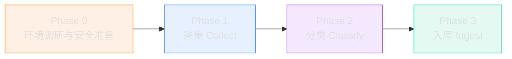

<div align="center">

# AOS — Agent Operating System

**给 AI 助手装上"记忆大脑"和"工作台"**

[🌐 官网](https://magicalyuyu.github.io/agent-operating-system/) · [📖 配置指南](docs/trae-setup-guide.md) · [🚀 快速开始](#快速开始)


</div>

---

如果你用过 AI 编程工具，可能遇到过这些情况：

- 🔄 每次新对话都要重新介绍项目背景，AI 的"记忆"仅限当前窗口
- 🔀 同时推进多个项目，AI 经常把 A 项目的配置写到 B 里
- 🕳️ 上次犯过的错误，下次对话还会再犯
- 📦 好不容易摸索出的经验，对话一关就消失了

**AOS 就是来解决这些问题的。**

它不是又一个 AI 框架，而是一套标准化的文件目录 + 规则体系。你把项目放进 AOS，AI 就知道文件该放哪、流程该怎么走、状态该怎么记。对话关了没关系，下次打开，AI 从磁盘读取状态，接着上次的进度继续。

---

## 它是怎么工作的

AOS 的核心思路：**所有状态都写在文件里，AI 每次启动时从文件读取，结束时写回文件。**


每个项目有独立的配置文件，AI 会根据你的指令自动识别当前项目，加载对应的规则。你不需要手动告诉 AI"我在做哪个项目"。

---

## 三大核心能力

| 能力 | 类比 | 说明 |
|:-----|:-----|:-----|
| 🧠 **跨会话记忆** | 助手的笔记本 | AI 每次对话自动读写记忆文件，新对话从磁盘恢复全部上下文 |
| 📁 **项目隔离** | 独立办公桌 | 每个项目独立配置、状态、文档，切换时自动加载对应上下文 |
| 🔧 **技能复用** | 标准操作手册 | 常用工作流封装成 Skill，一次定义、反复调用、团队共享 |

---

## 目录结构


每个目录都有明确的职责和约束，文件不会乱放，AI 也不会把日志写到项目目录里。

---

## AOS vs 传统方案

| 对比维度 | AOS | 传统方案 |
|:---------|:----|:---------|
| 技术依赖 | 纯文件系统，零代码 | 需要安装框架/运行时 |
| 上手成本 | 创建目录即可开始 | 学习 API、配置环境 |
| 跨工具兼容 | 任何 AI 助手都能用 | 绑定特定平台 |
| 可审计性 | 所有状态都是可读文件 | 状态藏在数据库/内存中 |
| 记忆持久化 | 磁盘写入，永不过期 | 内存存储，会话结束即消失 |
| 团队协作 | 文件即协议，Git 友好 | 需要额外同步机制 |

---

## 快速开始

### 1. 获取 AOS

```bash
git clone https://github.com/MagicalYuYu/agent-operating-system.git
```

或在 GitHub 仓库页面点击「Code → Download ZIP」。AOS 是纯文件结构，无需安装任何依赖。

### 2. 在 AI 工具中打开

**TRAE Work（推荐）**

1. 打开 TRAE Work → 点击「打开文件夹」→ 选择 AOS 目录
2. 切换到 **Code 模式**
3. TRAE Work 会自动读取根目录的 `AGENTS.md`，AOS 规则即开始生效

**其他平台（Claude Code / Codex）**

将 AOS 目录设为工作区根目录，参照 [03_TOOLS/adapters/](03_TOOLS/adapters/) 中的适配模板完成配置。

### 3. 配置 Rules 并验证

添加 3 条 Rules（详见 [配置指南](docs/trae-setup-guide.md)），然后运行自检脚本：

```bash
python 03_TOOLS/scripts/aos_check.py
```

输出 `一致性验证：通过` 即表示安装成功。

---

## 内置功能

### 网页知识入库（WKIS）

给一个 URL，自动提取结构化知识并存入参考知识库。支持技术文章、官方文档、架构分析等内容的自动压缩、重组和索引。

### 存量内容迁移

把散落各处的历史项目、对话记录、工作流程迁移到 AOS 体系。支持从 TRAE Work、Claude Code、ChatGPT、本地文件等多种来源迁移，包含完整的安全准备、脱敏处理和回滚机制。



详细的迁移操作指南见 [迁移指南](03_TOOLS/skills/legacy_migration/GUIDE.md)。

### 项目级配置

每个项目独立规则，AI 自动识别并加载。

### 一致性自检

内置脚本验证文件引用、版本号、索引是否一致。

### 可视化执行

AI 每步操作都展示进度，不会后台静默运行。

---

## 适配平台

| 平台 | 适配程度 | 说明 |
|:-----|:---------|:-----|
| TRAE Work | 最优适配 | 规则体系、Skill 机制均基于 TRAE Work Code 模式设计 |
| Claude Code | 支持 | 通过 CLAUDE.md 模板适配，见 [03_TOOLS/adapters/](03_TOOLS/adapters/) |
| Codex | 支持 | 通过配置映射适配 |

---

## 适用场景

AOS 适配各类开发与运维场景——无论你是做项目开发、内容管理、知识库构建还是系统运维，只要需要 AI 按规范流程稳定执行任务，AOS 都能提供标准化的文件组织和规则体系支撑。

---

## 文档索引

| 文档 | 位置 | 内容 |
|:-----|:-----|:-----|
| TRAE Work 配置指南 | [docs/trae-setup-guide.md](docs/trae-setup-guide.md) | Rules 和命令的完整配置步骤，可直接复制 |
| 迁移指南 | [03_TOOLS/skills/legacy_migration/GUIDE.md](03_TOOLS/skills/legacy_migration/GUIDE.md) | 存量内容迁移的完整操作流程 |
| 系统规则 | [AGENTS.md](AGENTS.md) | 执行模型、铁律、约束、触发机制一览 |
| 核心定义 | [00_BOOT/](00_BOOT/) | Agent 策略、Loop 引擎、Skill 注册、系统状态 |
| Skill 开发 | [03_TOOLS/skills/](03_TOOLS/skills/) | 每个 Skill 的完整指令、坑点、模板 |
| 工具脚本 | [03_TOOLS/scripts/](03_TOOLS/scripts/) | 自检、迁移采集/分类/入库脚本 |
| 记忆体系 | [04_MEMORY/](04_MEMORY/) | 索引、用户画像、反馈、项目状态 |
| 参考知识 | [09_REFERENCE/](09_REFERENCE/) | 系统设计文档、Web 知识库 |
| 项目模板 | [01_PROJECTS/_example_project/](01_PROJECTS/_example_project/) | 完整示例项目 |

每个目录下的 `README.md` 都有详细的"应放什么/禁止放什么"说明。

---

## 致谢

致敬互联网开放精神与每一位乐于分享的知识贡献者。

---

## 许可证

[MIT License with Additional Terms](LICENSE)

个人使用无任何限制。禁止将 AOS 单独封装后商用售卖。衍生项目鼓励标注来源，但不强制。
