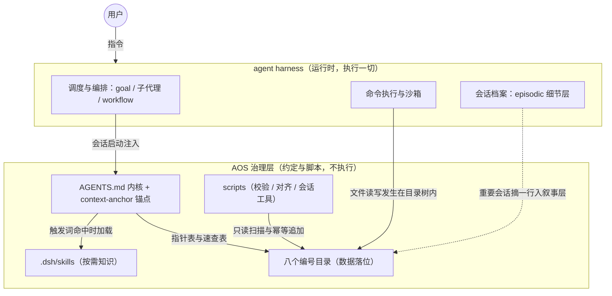
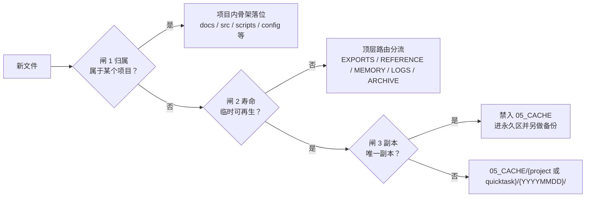

# AOS 2.0 架构参考

> 版本 2.0.0-rc.1 ｜ 本文说明 AOS 由哪些部分组成、每个机制怎么运转、各部分如何协同；约定的背景与设计依据见 [design-rationale.md](design-rationale.md)。

## 1. 总览：治理层与运行时

AOS 是运行在类 Claude Code agent harness 上的个人文件治理层。harness 提供运行时：调度、编排、沙箱、记忆通道；AOS 提供数据治理与工作流约定：东西放哪、知识存哪、状态记哪。治理层不执行任何东西，一切文件读写、命令执行、子代理派发都由运行时完成。两层靠 AGENTS.md 这份约定文件连接：harness 在会话启动时读取它，内容随会话常驻并约束后续操作，AOS 目录树则是这些约定作用的数据面。

平台适配分两档。DeepSeek Harness（DSH）为完整适配，skills 自动发现与按需加载、压缩锚点重注入、会话索引脚本全部可用；任何读取 AGENTS.md 约定的工具（Claude Code、Codex 等）为通用适配，目录宪章、指针表记忆、落位约定与校验脚本同样生效。脚本需要 Python 3.10+。

## 2. 目录详解

八个编号目录承载全部数据，`.dsh/` 与 `scripts/` 承载约定与工具：

| 目录 | 职责 | 写入 / 读取 | 关键约束 |
|---|---|---|---|
| `01_PROJECTS/` | 项目隔离存放 | 立项后 agent 写入代码与文档，会话中读写当前项目 | 两件套 AGENTS.md + README.md；项目内只引用 04_MEMORY / 09_REFERENCE 的路径 |
| `04_MEMORY/` | 唯一状态持久化中心 | 事实变化时 agent 更新状态文件；查画像与项目动态时经 INDEX.md 定位读取 | 状态型单文件 ≤32KB；INDEX.md ≤200 行 |
| `05_CACHE/` | agent 中间产物垃圾场 | agent 工作过程随时写入，仅本会话取回 | 唯一副本禁入；两级分层；禁止长期引用；超 90 天条目列入清理清单 |
| `06_LOGS/` | 运行日志，平台无关叙事层 | 治理事件与项目节点由 agent 追加一行；人类回溯与跨平台迁移时读取 | 只追加；memory_history.md 承接状态文件剪切的历史 |
| `07_EXPORTS/` | 输出导出，交付物唯一出口 | 交付完成时 agent 写入，用户从此处取成果 | 按项目分层；无项目任务进 quicktasks/ |
| `08_INBOX/` | 重量级外部输入中转区 | 外部大文件先落入，agent 处理后迁往归宿 | 按 YYYYMMDD 分层；迁走后原处留去向指针 |
| `09_REFERENCE/` | 唯一参考知识库 | knowledge-ingest 流程写入；调研与决策时读取 | 知识只存一份；条目头部记来源与日期；_index.md 加指针 |
| `99_ARCHIVE/` | 不可修改历史归档 | 退役内容按批次迁入，此后只读 | 只增不减；清理动作永不指向此目录 |
| `.dsh/` | 治理配置区 | 维护者编辑，harness 与 agent 读取 | context-anchor ≤30 行；skill-manifest.json 是环境清单唯一事实源 |
| `scripts/` | 校验与工具脚本 | 用户或 agent 调用，结果回终端或 06_LOGS | 检测模式全部只读；align_environment 加 --apply 时才改动环境；AOS 根按脚本自身位置推导 |

`.dsh/` 下三个成员各管一段：context-anchor.md 是压缩锚点；skills/ 存放七个治理技能（见第 5 节）；skill-manifest.json 登记环境组件。02 与 03 编号在 v1 中另有用途，v2 目录树未占用，沿革见 [MIGRATION.md](MIGRATION.md)。

## 3. 核心机制怎么运转

### 3.1 文件落位

创建或移动任何文件前，agent 依次过三道闸：

落位约定分三层，前后接住：

| 层 | 载体 | 生效时机 |
|---|---|---|
| 速查层 | AGENTS.md 落位速查表 | 落盘前先查，高频规则内联在常驻上下文 |
| 细则层 | file-placement skill 与 docs/file-conventions.md | 速查表未覆盖或判定存疑时按需加载 |
| 校验层 | scripts/check_placement.py | 落盘后随时扫描，报出违规项与修复去向 |

完整流程：agent 查速查表确定归宿，命中即落盘；表格未覆盖的情形（quicktask 阈值、项目内细分、建项目条件）读 skill 细则再判定；文件落盘后校验器可随时扫描全树，对项目根层堆放、src 内混入日志、截图、压缩包、非标日期命名、缓存与导出区根层散放等逐条给出 [error] 或 [warn] 前缀与去向提示。三层独立生效，前一层漏掉的由后一层接住。

### 3.2 记忆体系

| 类型 | 载体 | 写入时机 | 读取时机 |
|---|---|---|---|
| 状态（Semantic） | 04_MEMORY 的 user / project / credentials 文件 | 事实变化时覆盖旧值并留变更注释 | 会话开始查画像与项目动态，经 INDEX.md 定位后打开 |
| 记录（Episodic） | 双层：harness 会话档案与 goal（DSH 长目标自动续跑）事件流为细节层；06_LOGS 与 04_MEMORY/feedback/（经验条目）为叙事层 | 治理事件与项目节点一行追加；犯错与经验沉淀追加 feedback 条目；过程细节由 harness 自动记录 | 叙事层供人类回溯与跨平台迁移，细节层在平台内检索 |
| 程序性（Procedural） | .dsh/skills/*/SKILL.md 的 gotchas 段落 | 犯错后把规则沉淀进对应 skill | skill 加载时随全文进入上下文 |
| 工作（Working） | harness 会话上下文 | 会话进行中自动形成，不手工维护 | 压缩时按保留项落成摘要 |

INDEX.md 指针表是状态记忆的入口：一行一条 topic 指针加不超过 150 字的 hook，全表 ≤200 行，按活跃、低频、示例分组。查事实先读 hook，再打开指针指向的文件。

32KB 上限触发时的动作序列固定：先把文件完整内容归档至 99_ARCHIVE/{批次}/（或异地备份），再把历史段落剪切到 06_LOGS/{project}/memory_history.md，原文件保留指针；归档在剪切之前，顺序不可倒。剪切目的地是日志目录，历史仍可回溯。

入库纪律：写入 04_MEMORY 或 09_REFERENCE 前逐条过入库四问（相关、新、可信、有用，见 knowledge-ingest skill）；能从现有规则推导的内容不入库；经验条目按三要素书写（规则、Why、How to apply）。

### 3.3 上下文与会话

- **会话开始注入什么**：DSH 在会话启动时注入 AGENTS.md 全文，约定随会话常驻；AGENTS.md 首行的 `@.dsh/context-anchor.md` 引用把锚点文件一并带入（该展开由 context-imports 类插件承担，依赖登记在 skill-manifest.json）；.dsh/skills 各技能的 frontmatter 摘要进入技能目录，正文在触发词命中时加载。
- **压缩时保留什么**：任务目标与验收标准、修改过的文件路径、未解决错误、架构决策及理由、用户明确约束。token 预算超过 70% 时另有主动冲刷：把任务关键事实写入 04_MEMORY 或项目记忆，防压缩丢失。
- **锚点重注入怎么工作**：context-anchor.md 存放压缩后仍需记住的不变量（≤30 行）；context-imports 类插件在每次压缩后自动把它重新注入会话，不依赖模型回忆。
- **重要会话怎么进索引**：session_index_update.py 扫描 harness 会话档案，压缩体积 ≥512KB 或含 goal/change 事件的会话视为重要，把日期、会话 id 前 8 位、主题摘要追加到 06_LOGS/aos/session_index.md 的自动小节；追加幂等，脚本只写该小节，不触碰其余内容。
- **压缩后恢复**：先读 summary 的 Current Work，再读用户最新消息；两者一致则继续，不一致先确认意图再行动，防止旧事件误判。

### 3.4 任务与项目

quicktask 判定：任务无部署物、无独立 repo、产出少于 10 个文件且预计单会话完成，即按轻量任务归档，不建项目。

| 产出形态 | 去向 |
|---|---|
| 有交付物（报告、脚本、图） | `07_EXPORTS/quicktasks/{YYYYMMDD}_{slug}/` |
| 仅中间过程文件 | `05_CACHE/quicktasks/{YYYYMMDD}_{slug}/` |
| 结论有长期价值 | 提炼进 `09_REFERENCE/{domain}/`，原目录留指针 |
| 纯问答、无文件 | 不归档；值得记的偏好进 04_MEMORY |

slug 用 kebab-case、不超过 3 词，一旦定名不可改：跨会话续用同主题靠它匹配。

升级为项目按触发条件提醒。硬触发任一命中即提醒：同主题 quicktask 累计 ≥3 个；单任务产出 ≥10 个文件或总量 >50MB；需要独立部署物或运行时（建服务、开 repo、装依赖树）。软触发两项同时命中才提醒：跨 ≥3 个会话的同主题；产出含 ≥3 份设计或调研文档。提醒只建议不代建，用户确认后走 project-init skill 生成两件套并建项目记忆。

项目状态记在两处：跨会话动态写 04_MEMORY/project/proj_{name}.md（经 INDEX.md 定位），当前阶段写在项目 AGENTS.md 头部小节；独立的 PROGRESS.md、STATUS.md 文件不再使用。

### 3.5 环境对齐

manifest（.dsh/skill-manifest.json）登记三类组件：project-skill、dsh-plugin、user-skill，每条含名称、required 标记与 detect 探测路径；插件与用户级条目另含 install 补装命令，安装后补录 pin（版本或 commit 标识），多端版本对齐以 pin 为准。该文件是环境清单的唯一事实源，修改只走 write/edit 或 python json。

换环境时 aligner（scripts/align_environment.py）先按 detect 路径逐项探测组件，输出 OK、MISSING、BROKEN 三态，optional 与 retired 条目未安装不计缺失；随后做能力抽检（credentials.json 能否按 utf-8-sig 解析、EXA_API_KEY 是否在环境中）；最后以退出码报告：0 为全部就绪，2 为仍有缺失。加 `--apply` 时对缺失项执行 install 命令，安装后的复核与 pin 补录由人工完成，脚本会打印提示。

### 3.6 运行时能力与治理分工

harness 不断增强运行时能力（子代理调度、后台任务、定时任务、长目标续跑）。这些能力的执行归 harness，AOS 的角色是治理它们的使用方式：

| 运行时能力 | harness 管（执行） | AOS 管（治理约定） |
|---|---|---|
| 子代理调度 | 调度引擎、模型与档位选择（平台配置决定） | 是否委派与形态选择（subagent-dispatch）；委派 prompt 纪律（目标路径内联、长度控制）；产出落位与校验兜底 |
| 后台任务与唤醒 | job 系统、完成通知 | 事件驱动原则：等待后台结果时结束当前轮次，由通知唤醒，不做轮询空转；后台产出按落位约定归位 |
| 定时任务 | schedule 系统 | 治理节奏的定义（如巡检周期、索引更新频率）与无人值守产出的复核约定；当前版本未内置定时配置，属可选实践 |
| 长目标续跑 | goal 事件溯源与断点恢复 | 进度锚点写入记忆的约定；轮次预算纪律（等待型轮次提前让出） |

模型选择与成本路由不在 AOS 治理范围：由平台配置和用户环境决定。多档模型环境下，主动编排时可在指令中指定低成本模型承担批量分片，仅作参考实践，前提与边界见 subagent-dispatch skill。

## 4. 一次典型任务的完整流转

以「用户要求调研一个主题并产出报告」为例，这是最常见的 quicktask 形态。整个流转中治理层只提供判定规则与落位目标，执行全部由运行时完成：

| 步 | 发生什么 | 涉及部分 |
|---|---|---|
| 1 | 用户指令进入会话，约定与锚点已在上下文中 | harness / AGENTS.md / context-anchor |
| 2 | 判定任务形态：单会话、产出少于 10 文件、无部署物，定为 quicktask 并命名 {YYYYMMDD}_{slug} | file-placement skill |
| 3 | 落盘前查速查表：报告归 07_EXPORTS/quicktasks/，中间产物归 05_CACHE/quicktasks/ | AGENTS.md 速查表 |
| 4 | 调研执行：先验搜索渠道归属，关键结论回原文核对；抓取片段与整理笔记写入当日缓存目录 | knowledge-ingest / exa-search / 05_CACHE |
| 5 | 有长期价值的结论入库：写 09_REFERENCE/{domain}/{topic}.md，头部记来源 URL 与日期，_index.md 加一行指针；入库四问逐条过 | 09_REFERENCE / knowledge-ingest |
| 6 | 报告写入交付目录 | 07_EXPORTS |
| 7 | 记忆更新：调研得到的事实属状态型，覆盖旧值留变更注释；过程中的坑点属记录型，追加 feedback 条目 | 04_MEMORY |
| 8 | 日志落行：交付属治理事件，06_LOGS 追加一行；会话若重要，session_index 留一行 | 06_LOGS / session_index_update.py |
| 9 | 兜底扫描：check_placement.py 全树检查，error 项按提示修复后复跑 | scripts/check_placement.py |
| 10 | 会话结束或压缩：按保留项落摘要，锚点自动重注入，关键事实已提前冲刷落盘 | harness / context-anchor |

## 5. 工具参考

### scripts/（4 个）

| 脚本 | 用途 | 调用方式 | 关键参数与退出码 |
|---|---|---|---|
| check_placement.py | 落位校验器：项目四禁令、顶层散落、04_MEMORY 乱码、05_CACHE 超期、scripts 语法自检，只读 | `python scripts/check_placement.py [--root DIR] [--project NAME]` | `--root` 覆盖根目录，`--project` 只查单项目；退出码 0=无 error、1=有 error（warn 不影响）；缓存超期按 st_ctime 判定 |
| align_environment.py | 环境对齐器：按 manifest 检测缺失组件并支持补装 | `python scripts/align_environment.py [--apply]` | `--apply` 执行 install 命令；退出码 0=全部就绪、2=有缺失 |
| session_analyzer.py | 会话档案结构摘要：token、工具分布、错误、耗时 | `python scripts/session_analyzer.py [--sessions DIR] [--workspace NAME] [会话目录名]` | 需 `pip install zstandard`；缺省取压缩体积最大的会话 |
| session_index_update.py | 重要会话自动追加进索引 | `python scripts/session_index_update.py [--sessions DIR] [--workspace NAME] [--index FILE]` | 幂等追加，单次上限 30 行，只写自动小节；`--index` 指定目标文件 |

### .dsh/skills/（7 个）

| skill | 管什么 | 何时触发 |
|---|---|---|
| file-placement | 三道闸判定、项目内骨架、类型映射、quicktask 与建项目阈值 | 创建、下载、产出任何文件前；判定存疑时 |
| knowledge-ingest | 入库四问、调研渠道纪律、入库格式 | 用户提供 URL 或文件，要求入库、调研、沉淀知识 |
| subagent-dispatch | 是否委派、委派形态选择、成本路由、质量门禁载体 | 任务开始前判断自己做还是委派、用哪种形态 |
| inspection | 双频巡检流程、缓存清理清单、AGENTS.md 防蠕变 | 用户要求巡检或清理；距轻审超 4 周、深审超 12 周 |
| project-init | 新建项目两件套与项目记忆初始化 | 用户要求新建或导入项目 |
| exa-search | 高质量搜索的调用路径与渠道质量表 | 内置搜索不可用，或需要英文语义搜索、多源交叉验证 |
| dual-machine | 多机协同扩展点的边界约定与文档指针 | 两台以上机器协同 AOS 工作区、评估跨机同步时 |

## 6. 与其他文档的关系

本文（architecture.md）讲系统怎么运转：组成部分、机制流程、协同方式。docs/ 下另外三份各管一段：[design-rationale.md](design-rationale.md) 讲每个设计主张的背景与依据；[file-conventions.md](file-conventions.md) 是落位细则的完整文本，覆盖每类文件的归宿与目录命名，file-placement skill 是同一约定的运行时形态；[MIGRATION.md](MIGRATION.md) 是 v1 用户的升级指南，含目录对照与代部署提示词。仓库根 [README.md](../README.md) 负责上手与部署；AGENTS.md 是约定本身，本文是对它的展开说明。
