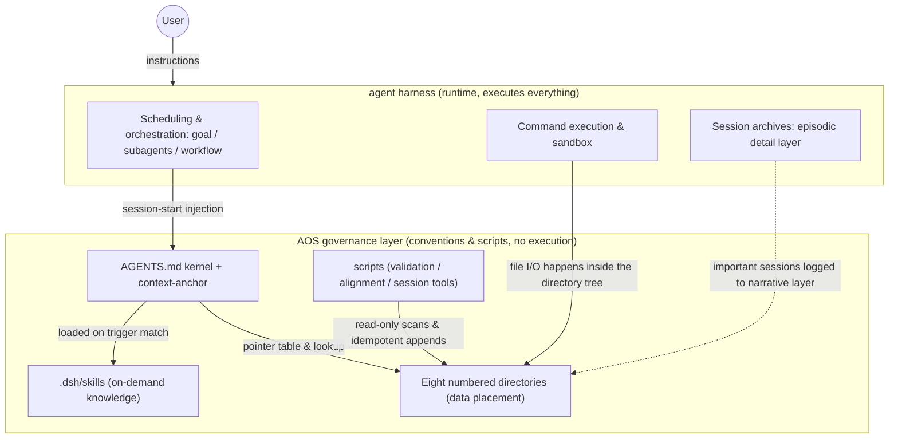
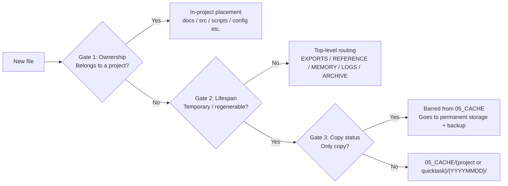

# AOS 2.0 Architecture Reference

> Version 2.0.0-rc.1 | This document describes what AOS consists of, how each mechanism works, and how the parts cooperate. For the reasoning behind these choices, see [design-rationale.md](design-rationale.md).

[中文版](architecture.zh-CN.md)

## 1. Overview: Governance Layer and Runtime

AOS is a file governance layer running on Claude Code-class agent harnesses. The harness provides the runtime: scheduling, orchestration, sandboxing, and memory channels. AOS provides data governance and workflow conventions: where things go, where knowledge lives, where state is recorded. The governance layer executes nothing; all file I/O, command execution, and subagent dispatch happen in the runtime. The two layers connect via AGENTS.md: the harness reads it at session start, its content stays resident and constrains subsequent operations, and the AOS directory tree is the data plane these conventions act upon.

Platform support comes in two tiers. DeepSeek Harness (DSH) is the full-adaptation platform: skills auto-discovery and on-demand loading, context compression anchor re-injection, and session indexing scripts are all available. Any tool that reads `AGENTS.md` conventions (Claude Code, Codex, etc.) gets generic adaptation: directory charter, pointer-table memory, placement conventions, and validator scripts all work. Scripts require Python 3.10+.

## 2. Directory Reference

Eight numbered directories carry all data; `.dsh/` and `scripts/` carry conventions and tools:

| Directory | Purpose | Written by / Read by | Key constraints |
|---|---|---|---|
| `01_PROJECTS/` | Project isolation | Agent writes after project creation; reads current project during sessions | Two-file template (AGENTS.md + README.md); projects reference 04_MEMORY / 09_REFERENCE by path only |
| `04_MEMORY/` | Single state persistence center | Agent updates state files on fact changes; reads via INDEX.md lookup | State-type files ≤32KB; INDEX.md ≤200 lines |
| `05_CACHE/` | Agent intermediate artifacts | Agent writes during work; retrieved within same session | No single copies; two-level hierarchy; no long-term references; entries >90 days listed for cleanup |
| `06_LOGS/` | Append-only logs, platform-independent narrative layer | Agent appends one line for governance events and project milestones; read for human review and cross-platform migration | Append-only; memory_history.md receives trimmed history from state files |
| `07_EXPORTS/` | Deliverable export, sole exit point | Agent writes on delivery; user retrieves from here | Per-project hierarchy; non-project tasks go to quicktasks/ |
| `08_INBOX/` | Heavy external input staging area | External files land here first; agent processes and relocates | YYYYMMDD hierarchy; pointer left after relocation |
| `09_REFERENCE/` | Single-copy knowledge base | Written via knowledge-ingest flow; read for research and decisions | One copy per knowledge item; source and date in header; indexed in _index.md |
| `99_ARCHIVE/` | Immutable history archive | Retired content moved in by batch; read-only thereafter | Append-only; cleanup never targets this directory |
| `.dsh/` | Governance configuration | Maintainer edits; harness and agent read | context-anchor ≤30 lines; skill-manifest.json is the single source of truth for environment inventory |
| `scripts/` | Validation and utility scripts | Called by user or agent; results to terminal or 06_LOGS | Detection mode is read-only; align_environment with --apply modifies the environment; root auto-derived from script location |

`.dsh/` has three members: context-anchor.md is the compression anchor; skills/ holds seven governance skills (see section 5); skill-manifest.json registers environment components. Directories 02 and 03 were used in v1 and are intentionally left vacant in v2; see [MIGRATION.md](MIGRATION.md).

## 3. How Core Mechanisms Work

### 3.1 File placement

Before creating or moving any file, the agent passes through three gates:

Placement rules operate in three layers:

| Layer | Carrier | When it applies |
|---|---|---|
| Quick reference | AGENTS.md placement table | Checked before every file creation; high-frequency rules inlined in resident context |
| Detail rules | file-placement skill and docs/file-conventions.md | Loaded on demand when the table doesn't cover the case |
| Validation | scripts/check_placement.py | Post-placement scans; reports violations with [error] or [warn] prefix and fix guidance |

The three layers work independently: whatever one misses, the next one catches.

### 3.2 Memory system

| Type | Carrier | When written | When read |
|---|---|---|---|
| State (Semantic) | user / project / credentials files in 04_MEMORY | Overwritten on fact change, with change note | Looked up via INDEX.md at session start |
| Record (Episodic) | Dual: harness session archives and goal event stream as detail layer; 06_LOGS and 04_MEMORY/feedback/ as narrative layer | Governance events and project milestones appended as one-liners; experience and pitfalls appended as feedback entries; process details recorded by harness automatically | Narrative layer for human review and cross-platform migration; detail layer for in-platform retrieval |
| Procedural | gotchas sections in .dsh/skills/*/SKILL.md | Errors distilled into the relevant skill after they occur | Loaded with full skill text on trigger |
| Working | Harness session context | Formed automatically during session | Condensed into a summary on compression |

INDEX.md is the entry point for state memory: one pointer per topic with a hook up to 150 characters, entire table ≤200 lines, grouped by activity level (active / low-frequency / example). To find a fact, read the hook first, then open the pointed-to file.

When the 32KB limit triggers, the sequence is fixed: first archive the complete file to 99_ARCHIVE/{batch}/ (or offsite backup), then trim history paragraphs to 06_LOGS/{project}/memory_history.md, leaving a pointer. Archiving comes before trimming; the order cannot be reversed.

Intake discipline: before writing to 04_MEMORY or 09_REFERENCE, each item passes four questions (relevant, novel, credible, useful — see knowledge-ingest skill). Anything derivable from existing rules stays out. Experience entries follow the three-element format (rule, why, how to apply).

### 3.3 Context and sessions

- **What gets injected at session start**: DSH injects AGENTS.md in full; its first line's `@.dsh/context-anchor.md` reference pulls in the anchor file (this expansion is handled by context-imports-type plugins, registered in skill-manifest.json). Each skill's frontmatter summary enters the skill catalog; full text loads on trigger match.
- **What gets preserved on compression**: task goals and acceptance criteria, modified file paths, unresolved errors, architectural decisions and reasoning, user-specified constraints. When token budget exceeds 70%, key facts are proactively flushed to 04_MEMORY or project memory.
- **How anchor re-injection works**: context-anchor.md holds invariants that must survive compression (≤30 lines). A context-imports-type plugin re-injects it automatically after each compression, without relying on model recall.
- **How important sessions enter the index**: session_index_update.py scans harness session archives. Sessions with compressed size ≥512KB or containing goal/change events are flagged as important. Date, first 8 characters of session ID, and a topic summary are appended to 06_LOGS/aos/session_index.md. Appends are idempotent; the script only writes to its designated section.
- **Post-compression recovery**: read the summary's Current Work, then the user's latest message. If they align, continue. If not, confirm intent before acting — this prevents misinterpreting old events as current instructions.

### 3.4 Tasks and projects

Quicktask criteria: no deployment artifacts, no standalone repository, fewer than 10 output files, expected to complete in a single session.

| Output type | Destination |
|---|---|
| Has deliverables (report, script, image) | `07_EXPORTS/quicktasks/{YYYYMMDD}_{slug}/` |
| Only intermediate files | `05_CACHE/quicktasks/{YYYYMMDD}_{slug}/` |
| Conclusions with long-term value | Distilled into `09_REFERENCE/{domain}/`, pointer left in original directory |
| Pure Q&A, no files | Not archived; notable preferences go to 04_MEMORY |

The slug uses kebab-case, ≤3 words, immutable once named (cross-session matching depends on it).

An upgrade to a project is triggered by conditions: 3+ quicktasks on the same topic, 10+ files or >50MB from a single task, or a need for independent deployment (service, repository, dependency tree). Soft triggers (both must be present): same topic across 3+ sessions AND 3+ design/research documents. The system suggests but never auto-creates.

Project state is recorded in two places: cross-session dynamics in 04_MEMORY/project/proj_{name}.md (located via INDEX.md), current phase in the project's AGENTS.md header. Standalone PROGRESS.md and STATUS.md files are no longer used.

### 3.5 Environment alignment

The manifest (.dsh/skill-manifest.json) registers three component types: project-skill, dsh-plugin, user-skill. Each entry has a name, required flag, and detect path. Plugin and user-skill entries also carry install commands; after installation, a pin (version or commit identifier) is recorded for cross-machine alignment. This file is the single source of truth for the environment inventory; modifications go through write/edit or python json only.

The aligner (scripts/align_environment.py) works as follows: it probes each component via its detect path, outputting OK / MISSING / BROKEN status (optional and retired entries not installed don't count as missing). It then runs capability checks (can credentials.json parse as utf-8-sig, is EXA_API_KEY in the environment). Finally it reports via exit code: 0 = all ready, 2 = missing items. With `--apply`, it executes install commands for missing items; post-install verification and pin recording are manual, with the script printing a reminder.

### 3.6 Runtime capabilities and governance split

Harnesses continuously add runtime capabilities (subagent scheduling, background tasks, scheduled tasks, long-goal continuation). Execution of these capabilities belongs to the harness; AOS governs how they are used:

| Runtime capability | Harness manages (execution) | AOS manages (governance) |
|---|---|---|
| Subagent scheduling | Scheduling engine, model and effort selection (platform config) | Whether to delegate and which form (subagent-dispatch); delegation prompt discipline (inline target paths, length control); output placement and validation |
| Background tasks & wakeup | Job system, completion notifications | Event-driven principle: yield current turn while waiting, wake on notification; background output placed per conventions |
| Scheduled tasks | Schedule system | Governance rhythm definitions (inspection cadence, index update frequency); unattended output review; no built-in scheduling in current version |
| Long-goal continuation | Goal event sourcing and checkpoint recovery | Progress anchor conventions; turn budget discipline |

Model selection and cost routing are outside AOS governance: they are determined by platform configuration and the user's environment. In a multi-tier model setup, low-cost models can be designated for bulk tasks in active orchestration; this is a reference practice only (see subagent-dispatch skill for conditions).

## 4. End-to-End Task Flow

Example: a user requests research on a topic with a report as deliverable. This is the most common quicktask form. The governance layer provides rules and targets; all execution happens in the runtime:

| Step | What happens | Parts involved |
|---|---|---|
| 1 | User instruction enters session; conventions and anchor already in context | harness / AGENTS.md / context-anchor |
| 2 | Task classified: single-session, <10 files, no deployment → quicktask, named {YYYYMMDD}_{slug} | file-placement skill |
| 3 | Pre-placement lookup: report → 07_EXPORTS/quicktasks/, intermediates → 05_CACHE/quicktasks/ | AGENTS.md placement table |
| 4 | Research: verify search channel, cross-check key conclusions against sources; notes to cache directory | knowledge-ingest / exa-search / 05_CACHE |
| 5 | Long-term conclusions stored: 09_REFERENCE/{domain}/{topic}.md with source and date; index updated; four intake questions passed | 09_REFERENCE / knowledge-ingest |
| 6 | Report written to deliverables directory | 07_EXPORTS |
| 7 | Memory update: research facts are state-type, overwritten with change note; process pitfalls are record-type, appended as feedback | 04_MEMORY |
| 8 | Log entry: delivery is a governance event, one line to 06_LOGS; important session indexed | 06_LOGS / session_index_update.py |
| 9 | Validation scan: check_placement.py full-tree check; errors fixed per hints, then re-run | scripts/check_placement.py |
| 10 | Session ends or compresses: summary per preservation rules, anchor auto-reinjected, key facts already flushed | harness / context-anchor |

## 5. Tool Reference

### scripts/ (4 scripts)

| Script | Purpose | Invocation | Key parameters & exit codes |
|---|---|---|---|
| check_placement.py | Placement validator: project rules, top-level placement, 04_MEMORY encoding, 05_CACHE age, scripts syntax. Read-only. | `python scripts/check_placement.py [--root DIR] [--project NAME]` | `--root` override, `--project` single project; exit 0=no errors, 1=errors (warnings don't affect); cache aging by creation time |
| align_environment.py | Environment aligner: detect missing components per manifest, optional install | `python scripts/align_environment.py [--apply]` | `--apply` runs install commands; exit 0=all ready, 2=missing |
| session_analyzer.py | Session archive structural summary: tokens, tool distribution, errors, timing | `python scripts/session_analyzer.py [--sessions DIR] [--workspace NAME] [session-dir]` | Requires `pip install zstandard`; defaults to largest session |
| session_index_update.py | Append important sessions to index | `python scripts/session_index_update.py [--sessions DIR] [--workspace NAME] [--index FILE]` | Idempotent append, max 30 per run, writes only to auto section |

### .dsh/skills/ (7 skills)

| Skill | What it governs | When triggered |
|---|---|---|
| file-placement | Three-gate placement, project structure, type mapping, quicktask and project thresholds | Before creating, downloading, or producing any file; when uncertain |
| knowledge-ingest | Intake questions, research channel discipline, storage format | User provides URL or file; requests ingestion, research, or knowledge capture |
| subagent-dispatch | Delegation decisions, form selection, cost routing, quality gates | Before tasks: do it yourself or delegate; which delegation form |
| inspection | Dual-frequency inspection, cache cleanup lists, AGENTS.md anti-bloat | User requests inspection; or >4 weeks since light audit, >12 weeks since deep audit |
| project-init | New project two-file template and memory initialization | User requests new or imported project |
| exa-search | High-quality search paths and channel quality table | Built-in search unavailable; or English semantic search, multi-source verification needed |
| dual-machine | Multi-machine extension points and boundary conventions | Multi-machine AOS workspace coordination; cross-machine sync evaluation |

## 6. Relationship to Other Documents

This document (architecture.md) explains how the system works: components, mechanisms, cooperation. The other documents in docs/ each cover a different aspect: [design-rationale.md](design-rationale.md) explains the reasoning behind each design decision; [file-conventions.md](file-conventions.md) contains the full text of placement rules; [MIGRATION.md](MIGRATION.md) is the v1-to-v2 upgrade guide. The repository root [README.md](../README.md) covers getting started and deployment; AGENTS.md is the convention itself, which this document expands upon.
