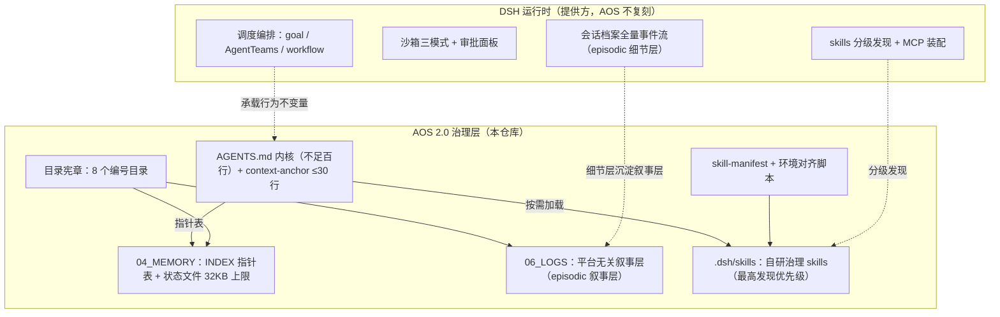

> 本文档为公开发布版；内部数据以汇总形式引用，原始记录不随仓库分发。

# AOS 2.0 设计思路（Design Rationale）

> 版本 2.0.0-rc.1 ｜ 试运行约一个月 ｜ 每个设计主张附可跳转来源；判断性内容标注为作者观点；引用内部数据处标"内部试运行记录"。

## 1. 总览

### 1.1 定位声明

AOS 2.0 是运行在 agent harness（DeepSeek Harness，DSH）上的**个人文件治理层**：**DSH 提供运行时（调度、编排、沙箱、记忆通道），AOS 提供数据治理与工作流约定**。规则只写不变量，一切按需知识通过指针表和 skills 检索。前身 v1 成型于 TRAE 平台，靠文件模拟操作系统，那个平台没有调度、状态管理与技能发现；迁移到 DSH 后这层模拟被整体拆除，重构为 8 目录宪章 + 精简 AGENTS.md + skills + 指针表记忆，经过一段时间的试运行。行业调研（约 48 个对象）中：SDD/流程框架赛道拥挤（[Spec Kit](https://github.com/github/spec-kit)、[OpenSpec](https://github.com/Fission-AI/OpenSpec)、[BMAD](https://github.com/bmad-code-org/BMAD-METHOD)），但未见与 AOS 直接等价的个人文件治理层。治理约定不绑定单一运行时，也可用于类 Claude Code harness；多机协同按可选扩展点对待，本发布包不附带跨机实现。

### 1.2 架构图（模块关系）

### 1.3 核心设计原则（8 条）

| # | 原则 | 一句话陈述 | 来源 |
|---|---|---|---|
| P1 | 运行时/治理分离 | harness 提供调度、编排、沙箱、记忆通道；AOS 只做数据治理与工作流约定，不在平台已提供能力处维护平行实现 | [DSH 仓库](https://github.com/deepseek-ai/deepseek-harness) |
| P2 | 常驻预算制 | 常驻上下文硬封顶：内核 ≤200 行、锚点 ≤30 行，溢出一律下沉 skill | [Claude Code Memory](https://code.claude.com/docs/en/memory) |
| P3 | 单一事实源 | 知识只存一份（Reference 唯一化）、状态单副本，禁止复制内容 | [agents.md 标准](https://agents.md/) |
| P4 | 记忆分型 | 记录型只追加；状态型覆盖旧值并留变更注释（人工 bi-temporal） | [Zep 论文](https://arxiv.org/abs/2501.13956) |
| P5 | 平台原生优先 | 治理机制先映射 harness 原生能力（审批、任务门禁、官方工具链），自研脚本次选 | [Claude Code Agent Teams](https://code.claude.com/docs/en/agent-teams) |
| P6 | 写码者不认证自己的 diff | 重大方案/高风险改动必须以独立上下文做红队审查 | [Spec Kit](https://github.com/github/spec-kit)（reviewer-owned checklist） |
| P7 | 事件驱动优于轮询 | 轮询式空转成本高于收益，实测后改为事件驱动 | 内部试运行记录；[Agent Teams](https://code.claude.com/docs/en/agent-teams) |
| P8 | 零和纪律 | 新增一条规则前先问能否删一条旧规则 | [Claude Code Memory](https://code.claude.com/docs/en/memory)（<200 行共识的延伸） |

## 2. 模块设计决策（四段式 ×10）

### 2.1 目录宪章（含退役论证）

**是什么**：8 个编号目录（01_PROJECTS / 04_MEMORY / 05_CACHE / 06_LOGS / 07_EXPORTS / 08_INBOX / 09_REFERENCE / 99_ARCHIVE），每目录一行职责 + 关键约束写入内核；v1 的 00_BOOT / 02_SANDBOX / 03_TOOLS 已退役，**编号空缺保留不回收**。

**为什么**：
- 00_BOOT 本质是无常驻运行时平台的**补偿性设计**，体积膨胀到数十 KB。其职责在新平台全部有原生继任者且实测在用：技能注册表→平台技能发现（试运行内多次 skill 增删均会话内即时生效）；循环引擎→goal 自动续跑（该文件从创建到归档活跃数始终为零、任务队列从未流转过一项）；两份巡检文档→压缩为巡检 skill。
- 02_SANDBOX→原生沙箱三模式；03_TOOLS→第三方组件改用户级安装。"目录存在本身就是回填邀请"在实践中有实证：曾出现过克隆仓库连着 .git 与 node_modules 一起住进模块目录的情况，与该目录自身的职责约定相悖。
- 中枢状态文件的对照案例：另一种技术方向保留的中枢状态文件，膨胀后被迫配套环形缓冲、裁剪前归档与历史索引，中枢文件膨胀到需要一套机制管理其自身，维护成本随之上升。
- **编号断层即演化账本（作者观点）**：空缺记录"平台已替代"的退役事实，防止后来者重新发明；原件归档留存、可翻案。方法论上，废弃时区分"平台已替代"与"暂无场景"，后者留活口。

**未采用的方向及原因**：保留并深化 00 目录。在平台已提供能力处维护平行实现不划算，且 v1 每会话固定注入上万 token 与任务无关的开销，v2 常驻开销低一个量级。**适用边界**：在无原生运行时的平台上，此类补偿设计是必需品，两个选择各自自洽。压缩为更少目录，未采用：职责分区是落位判定式的骨架（见 2.8），合并会让判定退化为主观判断。

**公开来源**：[OpenSpec](https://github.com/Fission-AI/OpenSpec)（changes→archive 生命周期同构）；[Agent OS](https://buildermethods.com/agent-os)（index + 按需注入同构）。

### 2.2 双层日志（episodic 记忆）

**是什么**：细节层 = 平台会话档案（全量事件流）+ goal 事件溯源，最全但平台绑定；叙事层 = 06_LOGS 只追加，人类可读、平台无关。治理事件（巡检/事故/发布/决策）与项目关键节点（立项/阶段切换/交付）必写一行；会话索引由脚本自动维护（超阈值或含 goal 的会话自动收录、幂等）。

**为什么**：
- 先说存在的问题：重构后叙事层一度停摆，是试运行期唯一的高严重度问题。根因是 v2 删除了 v1 全部强制日志触发机制而宪章未同步——设计漂移而非技术故障，评估后当日修宪修复。
- 保留叙事层的两条理由：①跨平台迁移保险——本项目经历过一次平台迁移，旧平台日志迁移后不可复用，行业迭代快，当前平台也不会是终点；②人类可读——不依赖任何平台工具即可审阅。

**未采用的方向及原因**：全靠平台会话档案、废除叙事层。修宪前它事实上独自支撑了整个停摆期且无损失，说明细节层承载力足够；叙事层价值在迁移保险与治理审计。复刻 v1 每步写盘触发链，未采用："三处同步"带来的对齐负担（见 2.3），每步写盘是无运行时平台的补偿设计。

**公开来源**：[Zep 论文](https://arxiv.org/abs/2501.13956)（bi-temporal）；[Claude Code Memory](https://code.claude.com/docs/en/memory)。

### 2.3 指针表记忆（INDEX + 32KB 上限）

**是什么**：04_MEMORY/INDEX.md 一行一指针 + 150 字 hook，≤200 行；状态型单文件 ≤32KB，超限**先归档再剪切**历史并留指针。试运行期最大状态文件保持在上限内；新经验条目严格三要素（规则 + Why + How to apply）。

**为什么**：
- 与官方 auto memory 同构（独立收敛）：官方注入上限 = 前 200 行或 25KB；AOS 的"指针表 + hook"比"前 N 行"更结构化，与内核行数上限构成双保险。
- 上限必要性来自实际经历：试运行环境中曾出现数个记忆文件膨胀失控致长会话退化的情况；v1 时代最大项目记忆从失控量级拆回正常量级。**先归档再剪切**保留审计链，优于截断式压缩。
- "能从现有规则推导的内容不入库"纪律是最强的反 write-spam 防线（业界有数万条目腐化的公开案例）；覆盖留变更注释 = 人工 bi-temporal，天然支持 as-of-when 推理。

**未采用的方向及原因**：环形缓冲，32KB 上限 + 先归档再外迁已是等价物，双机制徒增复杂度。STATUS/PROGRESS/proj 三处同步，未采用：多副本必漂移且对齐成本随副本数上升；单副本在试运行期零同步事故。向量库，没有采用（见 Q8），已预案参考库超千级条目时启用 SQLite 索引。

**公开来源**：[Claude Code Memory](https://code.claude.com/docs/en/memory)；[Mem0 论文](https://arxiv.org/abs/2504.19413)；[Basic Memory](https://github.com/basicmachines-co/basic-memory)。

### 2.4 skill 双层选位

**是什么**：自研治理 skills（file-placement / knowledge-ingest / project-init / subagent-dispatch / inspection 等）入项目 `.dsh/skills/`（发现优先级最高，随仓库版本化）；第三方/通用 skills 入用户级 `~/.agents/skills`（低优先级，与 AOS 解耦）。

**为什么**：
- 运行时源码实证分级发现序：项目 `.dsh/skills` > `.agents/skills` > 自定义 > 用户 `.dsh/skills` > 用户 `.agents/skills` > 内置（DSH `packages/skill/skill-filesystem`）。现有选位 = 治理语义拿最高优先、第三方拿跨工具共享位。
- 判定式（语义归属）：**"该组件换一个工作区还有意义吗？"** 有（如通用 SSH 工具）→ 用户级；没有（离开 AOS 治理语义即无意义）→ 项目内。能力边界不等于文件夹边界。
- 开放标准红利：SKILL.md 是跨厂商标准（40+ 客户端可消费），AOS 只用标准字段，同一份文件可被其他端直接读取。犯错沉淀到对应 skill 的 gotchas 段落，比提示词纠正可持久。

**未采用的方向及原因**：第三方技能（含完整 .git 克隆）全部塞项目内技能目录。这是可移植性换纯净度的权衡，技能随仓库走、跨机免配置，在多端携带场景成立；代价是仓库膨胀、与上游脱钩。判定为适用场景不同。全部塞最高优先级目录，未采用：污染仓库，第三方更新与 AOS 版本耦合。

**公开来源**：[agentskills.io 规范](https://agentskills.io/specification)；[Gemini CLI skills](https://github.com/google-gemini/gemini-cli/blob/main/docs/cli/skills.md)；[opencode skills](https://opencode.ai/docs/skills/)；[DSH 仓库](https://github.com/deepseek-ai/deepseek-harness)。

### 2.5 精简内核（AGENTS.md + context-anchor）

**是什么**：内核不足百行，硬上限 200 行写入文件头；`.dsh/context-anchor.md` ≤30 行常驻、压缩后自动重注入。常驻开销比 v1 低一个数量级。

**为什么**：
- 官方共识：单份规则文件目标 **<200 行**（超长降低 instruction adherence，见 [Claude Code Memory](https://code.claude.com/docs/en/memory)）；官方"常驻不变量 + 路径条件加载"分层与 AOS"高频内联 + 低频下沉 skill"同构。
- @import 全量展开是硬成本：官方明确 imports 不省上下文（启动即展开）→ 锚点 ≤30 行红线与 200 行上限一并纳入巡检量纲。
- 防蠕变零和纪律（P8）与增长受控不矛盾：内核从初版逐步增长，每次增长均有裁决记录，外来吸收带出处标注。

**未采用的方向及原因**：v1 的数百行内核 + 启动强制读多个文件，每轮固定付出与任务无关的开销。旧平台范式全文内联（弹窗判定/交互循环/可视化规范），未采用：新平台已有原生计划审批、工具审批与终端可视化。"过于精简反而负荷高"的批评实际收到过。回应是再平衡而非加行数：高频落位规则内联为速查表、低频细则下沉 skill；指针遵守率衰减的对策是锚点压缩后重注入，也不是加行数。

**公开来源**：[Claude Code Memory](https://code.claude.com/docs/en/memory)；[DSH 仓库](https://github.com/deepseek-ai/deepseek-harness)。

### 2.6 行为不变量（8 条）

**是什么**：8 条不变量常驻内核，逐条论证如下。

| # | 不变量 | 论证要点 | 来源 |
|---|---|---|---|
| 1 | 对抗审查：独立上下文红队，写码者不认证自己的 diff | Self-Attribution Bias：同模型自审系统性偏松，仅会话隔离即可消除大部分偏置；Spec Kit checklist 为 reviewer-owned。内部实测中独立红队抓出过阻断级问题 | [LessWrong](https://lesswrong.com/posts/Y4rFNoLaCd7GwdpZj)、[arXiv 2603.12123](https://arxiv.org/abs/2603.12123)、[Spec Kit](https://github.com/github/spec-kit) |
| 2 | 同一错误两次纠正失败 → 写简报建议换新会话 | 长上下文遵守率随轮次衰减；Ralph fresh-agent 路线：上下文不积累则不退化，状态落盘替代会话记忆。依赖模型记忆的纠正计数实测失灵——对策：计数绑可检测载体（feedback 同名条目第二次更新 → 回复附提示） | [wiggum.dev](https://wiggum.dev/)、[how-to-ralph-wiggum](https://github.com/ghuntley/how-to-ralph-wiggum) |
| 3 | 模型路由：低推理批量任务 → 低成本批量模型；强推理与决策 → 主模型 | per-subagent `model` 字段是官方标准实践（官方示例即"廉价工作用轻量模型"）；内部实测批量分片任务成本可忽略，个别质量偏差均被落盘复核拦截 | [Claude Code Subagents](https://code.claude.com/docs/en/sub-agents) |
| 4 | 批量清理三审：批量模型产 manifest → 主控复核 → 人工终审；唯一副本先异地备份 + 哈希校验 | 删除不可逆；"备份与数据同爆炸半径"是反复出现的事故模式 | 内部事故记录 |
| 5 | 运行时数据禁区：生产运行时数据、数据库、日志内容绝不动 | 标准安全共识 | 内部审计记录 |
| 6 | 防蠕变：≤200 行 + 零和纪律 | 官方 <200 行共识；内核每次增长有裁决记录可溯 | [Claude Code Memory](https://code.claude.com/docs/en/memory) |
| 7 | 发布门禁：任何公开发布须使用者当次显式批准；计划批准不等于发布授权 | 实际运行中出现过越权发布尝试被人工拦截的事件，当日固化为不变量；"提示词不是安全控制，需硬边界" | 内部事故记录 |
| 8 | 落盘前查路由：速查表 → skill 细则 → 校验器 | 落位规则新会话盲测命中率约半数 → 高频规则内联再平衡；校验器兜底。存量结构违规在升级校验器后当日清零 | 内部试运行记录 |

**未采用的方向及原因**：全部不变量脚本强制。运行时强制是趋势，但平台原生审批/任务门禁已提供强制点，优先映射原生（P5）。不变量①的默认载体为运行时任务评审（结构化 verdict/findings 字段），轻量场景保留独立子代理红队。

**公开来源**：上表所列公开链接。

### 2.7 环境对齐（skill-manifest + 对齐脚本）

**是什么**：`.dsh/skill-manifest.json` 为唯一事实源（项目 skill 与平台插件分区，每条含 detect/install/pin 字段）；`scripts/align_environment.py` 一键检测补齐。

**为什么**：
- 多环境漂移实证：曾有 skill 在不同环境各自创建、互不知情——评审后合入 manifest 闭环；对齐脚本一处相对路径 bug 曾致全部 skill 误报损坏。"在场不等于检测到"。
- 平台升级风险（源码实证）：较新版本起，插件兼容检查对声明不兼容的组件**静默跳过**——社区插件全在风险区，故升级规程固化：备份配置 → 盘点不兼容项 → 逐插件验证加载。

**未采用的方向及原因**：纯平台原生、无 manifest。平台有插件兼容检查但 skills 无版本对账能力；manifest 为自建、与上游零冲突。lockfile 哈希思想，部分吸收（版本 pin 已用；安装树易变，pin + 安装源 + 行为核验已够）。

**公开来源**：[DSH 仓库](https://github.com/deepseek-ai/deepseek-harness)；仓库内 manifest 与脚本。

### 2.8 轻任务阈值（quicktask / 项目分层判定）

**是什么**：三层判定，内核"落位速查表"内联高频规则（7 行产出→路径映射）→ file-placement skill 存细则（quicktask 阈值/建项目条件/项目内多级分层，全部可程序化）→ `scripts/check_placement.py` 兜底校验。轻量任务走 `07_EXPORTS/quicktasks/{YYYYMMDD}_{slug}/`；中间产物进缓存目录（唯一副本禁入）。

**为什么**：
- 个人使用场景中轻量任务高频出现，需要比"建项目"更轻的容器与明确判据；项目门槛即两件套（AGENTS.md + README）。
- 内联/下沉分界依据实测而非直觉：落位规则新会话盲测命中率约半数，说明纯指针方案对高频规则不可靠 → 依外部评审把高频规则内联进内核、低频细则下沉 skill。
- 校验器是必要层：试运行期仍会积累结构违规（缺命令地图/源码杂物/根层散放/非标日期四类）——漂移必然发生，判定式必须可程序化。

**未采用的方向及原因**：一律建项目，轻量任务密度下项目开销不成比例。无判定式凭感觉，子代理规则遵守率约五成为实测值，判定式 + 脚本兜底是对概率性遵守的工程对冲。为特定工作流特化的精细文件分类法，存档引用不吸收：未在通用场景实测。

**公开来源**：仓库内 file-placement skill 与校验器。

### 2.9 文件操作纪律（4 条铁律）

**是什么**：4 条无条件铁律，①中文内容文件只准 write/edit 工具（或显式 utf-8 的脚本），禁 shell 管道/重定向写入；②JSON/YAML 写 UTF-8 带 BOM、读取按 utf-8-sig；③YAML description 以 `[` 开头必须加引号、含反斜杠路径用单引号串；④结构化文件（manifest 等）修改禁用 shell 字符串替换。

**为什么**：试运行初期集中出现多起文件操作事故，多为编码与转义问题（管道写中文的乱码、YAML 解析失败、manifest 字符串替换损坏）。铁律约束的是**工具选择**这一步：事故全部发生在绕开官方工具链走 shell 的路径上，治法是封住危险路径。

**未采用的方向及原因**：统一脚本写入链（所有写入走带编码/原子性保证的脚本）。不采用为默认路径（P5 平台原生优先），但承认其机械保证的价值：这种技术方向的做法能可靠捕获真实损坏。对应动作是校验器前移（新增乱码扫描/缓存 TTL/脚本语法冒烟三项检查）而非复制脚本链。"提示模型小心点"，未采用：提示词是请求不是执行。

**公开来源**：[Claude Code 功能文档](https://code.claude.com/docs/en/features-overview)（官方工具链）；仓库内 AGENTS.md 铁律节。

### 2.10 跨会话上下文（压缩保留与恢复规程）

**是什么**：三层机制，①内核"压缩保留项"：会话压缩时必须保留任务目标与验收标准、修改过的文件路径、未解决错误、架构决策及理由、使用者明确约束；②context-anchor ≤30 行压缩后自动重注入；③"压缩后恢复 4 步"：读摘要的当前工作 → 读使用者最新消息 → 一致则继续 → 不一致先确认意图再行动。

**为什么**：压缩是有损的，摘要会丢约束与未解决错误，旧事件易被误判为当前指令；恢复 4 步把"防误判"规程化。与 Ralph fresh-agent 路线同一原理：上下文不积累则不退化，状态落盘替代会话记忆。重要会话一行入索引、脚本自动维护（幂等），跨会话检索不依赖平台绑定档案。

**未采用的方向及原因**：完全信任压缩摘要，丢约束与错误的真实案例存在。每次压缩后人工复盘，成本不成比例。跨会话状态全部塞常驻上下文，直接违反 P2 预算制。

**公开来源**：[Claude Code Memory](https://code.claude.com/docs/en/memory)；[wiggum.dev](https://wiggum.dev/)、[how-to-ralph-wiggum](https://github.com/ghuntley/how-to-ralph-wiggum)。

## 3. 常见问题（FAQ）

**Q：为什么不用统一脚本写入链？提示词遵守率只有约五成，机器强制才是正解。**
A：运行时强制确实是趋势。分歧在优先级：harness 原生已有 write/edit 工具、任务门禁、审批与沙箱这些官方强制点，治理机制先映射它们约零成本；自研上千行脚本链是次选，脚本自身也会故障，需要配套降级条款即是证明。校验器思想已吸收（乱码扫描/TTL/语法冒烟三项扩展）。（[Agent Teams](https://code.claude.com/docs/en/agent-teams)）

**Q：为什么删掉启动自检目录？启动自检/系统状态是工程常识。**
A：它是无运行时平台的补偿设计，五块职责全部有原生继任者且实测在用；循环引擎从创建到归档活跃数始终为零，实际未被用过。保留它的对照线：那种做法需要为状态文件本身维护一套管理机制。**边界**：在无原生运行时的平台上它是优选，删它的前提是平台换了。（内部退役评审记录）

**Q：为什么不要环形缓冲？**
A：已有等价物（32KB 上限 + 先归档再外迁），双机制徒增复杂度；环形缓冲针对的正是中枢文件膨胀带来的管理问题。已吸收其"裁剪前先归档"一句并入宪章。（[Zep 论文](https://arxiv.org/abs/2501.13956)）

**Q：叙事日志层停摆过一段时间，是否有必要保留？**
A：停摆确实发生过，是试运行期唯一的高严重度问题，也写进了内部评估。根因是删除旧触发机制而宪章未同步，设计漂移，非设计错误；评估后当日修宪落地。保留的理由：平台迁移保险 + 人类可读。若修宪后再停摆，欢迎以此节为凭追问。（内部试运行记录）

**Q：内核不到一百行，是不是过简？关键规则不在上下文里模型就忘。**
A：三组事实：①"过简"批评实际收到过，回应是把高频规则内联为速查表（再平衡）；②指针遵守率衰减的对策是锚点压缩后重注入，而非加行数；③常驻开销比大内核低一个数量级，官方同款 <200 行共识。遵守率才是关键，由校验器与门禁兜底。（[Claude Code Memory](https://code.claude.com/docs/en/memory)）

**Q：允许 Agent 自主续跑、多轮无人值守，失控风险不大吗？**
A：护栏不是禁止自主，是三门禁：发布门禁、运行时禁区、对抗审查，且人工可随时接管，轮询式空转就曾被人工叫停。官方 Agent Teams（lead + teammates + 共享任务表）证明此模式是主航道；本项目自主续跑多轮零状态丢失。（[Agent Teams](https://code.claude.com/docs/en/agent-teams)）

**Q：编排组件还标 experimental，把审查流建在上面是否稳妥？**
A：风险承认并有对冲：锁版 + 升级前 diff 该组件包（已入升级规程）。选型逻辑：与官方 Agent Teams 同构，在主航道上；对照的自研编排框架面向企业部署平台、个人场景过重。且红队审查不单点依赖它：独立子代理是平级载体。（[claude-flow 对照案例](https://github.com/ruvnet/claude-flow)；[Cognition](https://cognition.ai/blog/dont-build-multi-agents)）

**Q：纯文件记忆不上向量库，检索规模上限低。**
A：行业已收敛到文件式（官方 memory tool 100 轮任务 +39%、多家 agent 产品以目录+文件为载体，向量库降级为 RAG 专用）。单用户千级条目下"文件 + 轻量指针索引"验证充分；向量库的适用场景是大规模非自写语料的模糊检索，AOS 无此负载。已预案：参考库超千级条目时启用 SQLite 索引。另一面的数据：MCP 常驻 3 个 server 可占 200K 窗口 72%，重基建的上下文税会先成为问题。（[memory tool](https://platform.claude.com/docs/en/agents-and-tools/tool-use/memory-tool)、[MCP context tax](https://unabyss.com/blog/mcp-context-tax)）

**Q：目录宪章无社区先例，自创标准凭什么可信？**
A：承认。无先例也意味着没有现成的外部校验参照，质量只能靠自身机制维持，内部评估对此有明确记录。对冲机制：盲测（命中率约半数→修正再平衡）、对抗审查、双频巡检、本文档的证据链。部分结构另有社区同构物佐证方向：OpenSpec 的 changes→archive 生命周期 ≈ 08_INBOX→99_ARCHIVE；Agent OS 的 index+按需注入 ≈ 指针表。（[OpenSpec](https://github.com/Fission-AI/OpenSpec)、[Agent OS](https://buildermethods.com/agent-os)）

**Q：提示词不变量遵守率约五成，8 条不变量是不是纸面文章？**
A：部分成立，所以分三层：①高危动作走硬门禁（发布须使用者当次批准，有真实事故背书）；②可检测的走校验器兜底；③其余接受概率折扣并以对抗审查抽查。Spec Kit 同为提示词约定（无运行时强制），其 reviewer-owned checklist 依然有效，设计质量与载体强度是两件事。（[Spec Kit](https://github.com/github/spec-kit)）

**Q：结构违规积累了一段时间才发现，机制本身是否也依赖自觉？**
A：承认，这正是中期评估的存在意义。已知欠账："漂移只靠事后巡检兜底"，升级主轴即"把治理从靠自觉变成低成本机制"。闭环结果：存量违规经 manifest → 主控复核 → 执行处置当日清零；校验器前移与三项扩展同日落地。另自我声明：校验器的价值在捕获未来漂移，不证明当前内容质量，这对任何方案的"全绿"同样适用。（内部试运行记录）

**Q：为什么用 AGENTS.md 而不用 CLAUDE.md？**
A：单源策略。AGENTS.md 已成事实标准（6 万+ 仓库、基金会托管、约 25 工具原生读取），Claude Code 官方明确可读 AGENTS.md。维护 CLAUDE.md 副本 = 人为制造一个需要同步的副本，违反 P3。（[agents.md](https://agents.md/)、[Claude Code Memory](https://code.claude.com/docs/en/memory)）

## 4. 与其他技术方向的关系

生态中的个人 agent 治理方案可归纳为两条方向：**脚本化门禁**（规范代码化：统一写入脚本链、输出前强制检查门禁）与**多端兼容**（技能主库跨客户端携带、多端配置适配）。

| 维度 | 脚本化门禁方向 | 多端兼容方向 | AOS 2.0 |
|---|---|---|---|
| 强制点 | 自研脚本链 + 输出前门禁（能可靠捕获真实损坏） | 各端 hooks/权限配置 | 平台原生审批/任务门禁优先，校验器兜底，自研脚本次选 |
| 状态管理 | 多处同步 + 校验器对齐（对齐成本随副本数上升） | 主库随仓库走 | 单副本，零同步事故 |
| 内核形态 | 规范全文内联（数百行） | 多端配置并存 | ≤200 行 + 锚点 + skill 下沉 |
| 多端策略 | 单主场 | 多客户端实测、免配置携带 | 标准字段红利 + 按需生成，零自研适配层 |
| 主要代价 | 脚本自身会故障，需降级条款 | 维护面随端数翻倍 | 依赖单一运行时的强制能力 |

各方向在各自前提下自洽：脚本化门禁适合无原生强制点的平台；多端兼容适合跨工具日常。AOS 的选择由"单主场 + 运行时原生能力强"推出，前提变化时选择应重估。两条方向的可取之处均已以适配形式吸收：门禁思想 → 校验器前移；标准字段纪律 → 只用开放标准字段。

## 5. 来源索引（均为公开资源）

- **规则与技能标准**：AGENTS.md https://agents.md/ ｜ Agent Skills 规范 https://agentskills.io/specification ｜ 客户端名录 https://agentskills.io/clients ｜ 官方示例库 https://github.com/anthropics/skills
- **Claude Code 官方文档**：memory https://code.claude.com/docs/en/memory ｜ sub-agents https://code.claude.com/docs/en/sub-agents ｜ agent-teams https://code.claude.com/docs/en/agent-teams ｜ features-overview https://code.claude.com/docs/en/features-overview
- **Anthropic 工程博客**：Agent Skills https://www.anthropic.com/engineering/equipping-agents-for-the-real-world-with-agent-skills ｜ multi-agent research system https://www.anthropic.com/engineering/multi-agent-research-system ｜ memory tool https://platform.claude.com/docs/en/agents-and-tools/tool-use/memory-tool
- **SDD / 框架**：Spec Kit https://github.com/github/spec-kit ｜ OpenSpec https://github.com/Fission-AI/OpenSpec ｜ BMAD https://github.com/bmad-code-org/BMAD-METHOD ｜ Agent OS https://buildermethods.com/agent-os
- **多端 / 生成器 / MCP**：rulesync https://github.com/dyoshikawa/rulesync ｜ Gemini CLI skills https://github.com/google-gemini/gemini-cli/blob/main/docs/cli/skills.md ｜ opencode https://opencode.ai/docs/skills/ ｜ MCP 官方 servers https://github.com/modelcontextprotocol/servers ｜ context tax 实测 https://unabyss.com/blog/mcp-context-tax
- **记忆研究与路线**：Mem0 https://arxiv.org/abs/2504.19413 ｜ Zep https://arxiv.org/abs/2501.13956 ｜ Basic Memory https://github.com/basicmachines-co/basic-memory ｜ Manus https://manus.im/blog/Context-Engineering-for-AI-Agents-Lessons-from-Building-Manus ｜ 文件 vs 向量 https://dreaming.press/posts/filesystem-vs-vector-database-agent-memory.html
- **审查与编排**：Cognition https://cognition.ai/blog/dont-build-multi-agents ｜ Self-Attribution Bias https://lesswrong.com/posts/Y4rFNoLaCd7GwdpZj ｜ Cross-Context Review https://arxiv.org/abs/2603.12123 ｜ Ralph https://wiggum.dev/ 、https://github.com/ghuntley/how-to-ralph-wiggum ｜ claude-flow（对照案例）https://github.com/ruvnet/claude-flow
- **运行时**：DeepSeek Harness https://github.com/deepseek-ai/deepseek-harness（官方；桌面端见 https://www.deepseek.com/en/harness/ ）｜ 社区桌面端 anywhere-labs/dsh-desktop https://github.com/anywhere-labs/dsh-desktop

## 6. 演化史

### 6.1 时间线

| 时间 | 事件 |
|---|---|
| 2026 年中 | v1 体系在 TRAE 平台成型：运行时铁律、启动自检目录、状态三连写 |
| v1.1.0 | 首次公开发布，冻结于 git tag |
| 2026-08 | DSH 开放 developer preview |
| 2026-09 | AOS 2.0 重构上线：8 目录宪章 + 精简内核 + skills + 指针表；发布门禁同日固化；随后完成全面审计与落位规则再平衡 |
| 试运行期 | 中期评估（含行业调研与运行时源码分析）：episodic 修宪、压缩恢复规程吸收、存量违规清零、校验器扩展、会话索引自动化；本文档定稿 |

### 6.2 退役清单（v1 → v2；原件归档留存、可翻案）

| v1 构件 | 继任者 / 去向 | 复核结论 |
|---|---|---|
| 00_BOOT | 三块平台原生替代、两块压缩成 skill、一块从未真正运行、两块并入内核 | 站得住（继任表逐项实测） |
| 02_SANDBOX | 原生沙箱三模式 | 站得住 |
| 03_TOOLS | 第三方 → 用户级 skills / 平台 profile；自研 → 项目内 skills | 站得住 |
| STATUS/PROGRESS 三连写 | 单副本（项目 AGENTS.md 头部摘要） | 站得住（零同步事故） |
| SKILL_REGISTRY | 平台原生技能发现 | 站得住 |
| LOOP_ENGINE | goal 自动续跑 | 站得住（活跃数恒为零） |
| SYSTEM_STATE | 分布式状态 + 日志事件 | 站得住（中枢文件膨胀对照案例在先） |
| 启动自检多文件强制读取 | AGENTS.md 常驻注入 + context-anchor | 站得住 |
| 日志触发机制 | 误删 → 中期评估修宪补回（双层 episodic） | 唯一缺口，已修复 |

方法论补强：废弃遗产时区分"平台已替代"与"暂无场景"，后者留活口。社区实践中部分同类遗产仍在继续演化，说明"退役"应是可翻案的判决而非一次性处决。
